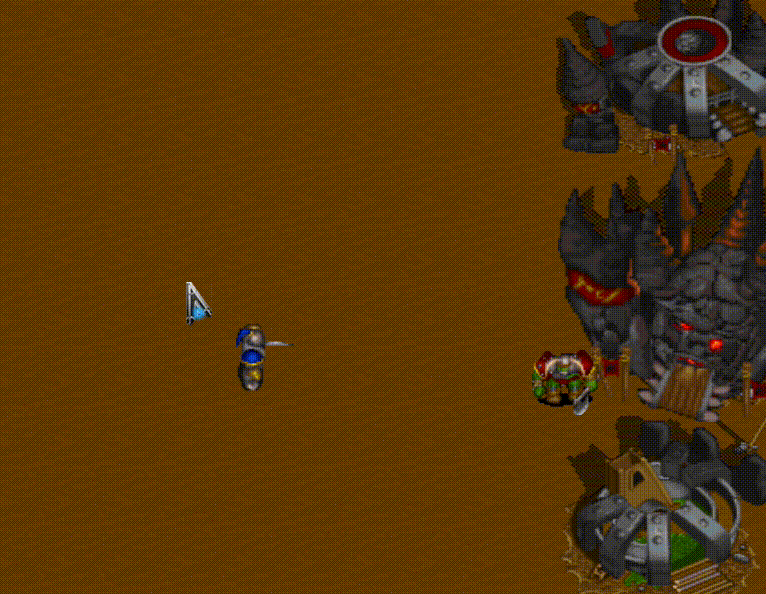
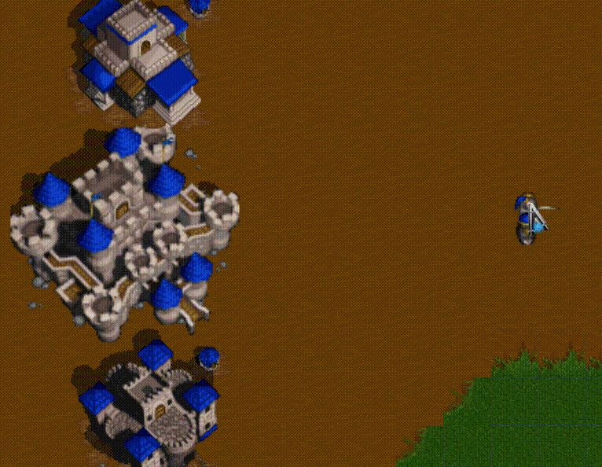

# Unity-Warcraft2
Simple Warcraft implementation using Unity

### Unit selection by dragging
The selected units are highlited. 

### 8 directional unit movement animation
All animations are made out of 2D sprites. 

### Unit group movement
A Group doesn't merge in to the one point. It maintains its formation always. 

### Unit spawner
A spawner will spawn a unit every 10 secs.
